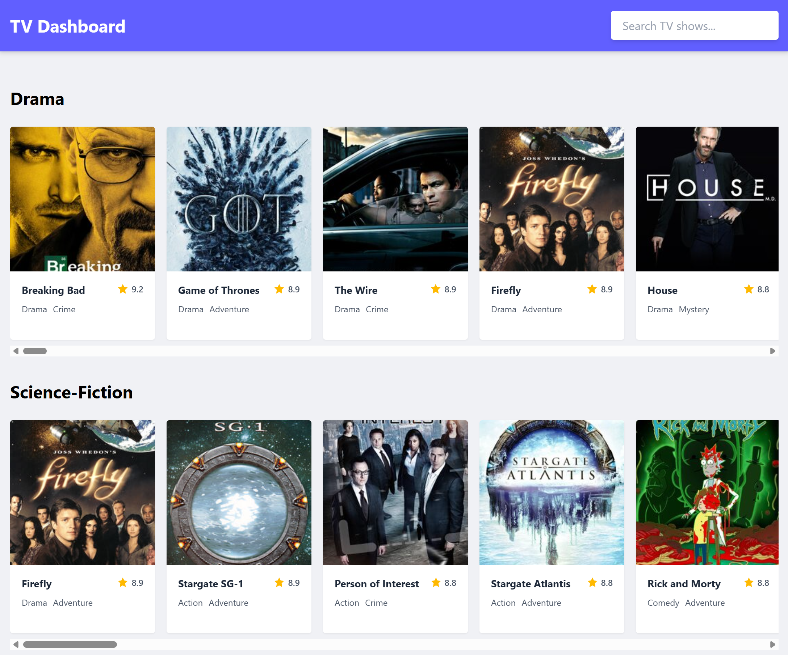

# TV Shows Dashboard

A modern, responsive TV show dashboard built with Vue 3, TypeScript, and Tailwind CSS. Browse shows by genre, search for your favorites, and view detailed information about each show. Application uses data from [TVMaze API](https://www.tvmaze.com/api).



## Features

- Browse TV shows organized by genre and also sorted by rating.
- Search functionality to find specific shows
- Responsive, mobile-first design that works on all devices
- Built with Vue 3 and Composition API
- Styled with Tailwind CSS
- Tested with Vitest

## Tech Stack

- [Vue 3](https://vuejs.org/) - Progressive JavaScript Framework
- [TypeScript](https://www.typescriptlang.org/) - Type-safe JavaScript
- [Vite](https://vitejs.dev/) - Next Generation Frontend Tooling
- [Vitest](https://vitest.dev/) - Fast unit testing framework
- [Tailwind CSS](https://tailwindcss.com/) - Utility-first CSS framework
- [TVMaze API](https://www.tvmaze.com/api) - TV show data

## Prerequisites

- Node.js 18+
- npm

## Project Setup

1. Clone the repository:
   ```bash
   git clone https://github.com/ckomop0x/tv-show-dashboard.git
   cd tv-show-dashboard
   ```

2. Install dependencies:
   ```bash
   npm install   
   ```

3. Start the development server:
   ```bash
   npm run dev   
   ```

4. Open [http://localhost:5173](http://localhost:5173) in your browser.

## Running Tests

To run unit tests:

```bash
npm test
```

## Building for Production

To create a production build:

```bash
npm run build
# or
yarn build
```

## Project Structure

```
src/
├── assets/          # Static assets
├── components/      # Reusable Vue components
├── composables/     # Vue composition API functions
├── pages/           # Page components
├── router/          # Vue Router configuration
├── services/        # API services
├── types/           # TypeScript type definitions
└── App.vue          # Root component
```

## License

This project is unlicensed.
